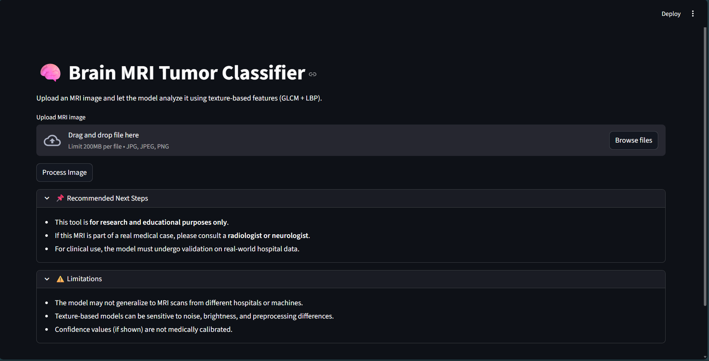
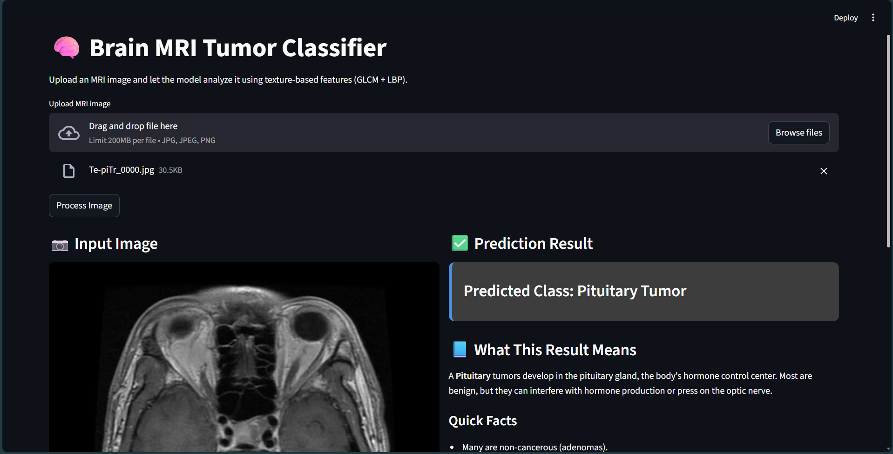

# 🧠 Brain Tumor Classification App  
A Streamlit-based machine learning application for classifying brain MRI images into **Glioma**, **Meningioma**, **Pituitary**, or **No Tumor** using texture‑based features (GLCM + LBP) and an SVM classifier.

---

## 📌 Overview  
This project provides a lightweight, fast, and educational tool for analyzing brain MRI images.  
The system extracts texture features from the uploaded image and predicts the tumor class using a trained machine learning model.

✅ Built for research and learning  
✅ Fully local processing  
✅ Clean UI with explanations and insights  

> ⚠️ **Disclaimer:** This application is not intended for medical diagnosis.  
> It is a research and educational tool only.

---

## 🖼️ Demonstration  
Below are example screenshots of the application in action.  
Replace the image paths with your own screenshots.

### ✅ Home Interface  


### ✅ Upload & Prediction  



### ✅ Video Demonstration

---

## 🧠 Supported Classes  

- 🔴 **Glioma**
- 🔵 **Meningioma**
- 🟡 **Pituitary**
- 🟢 **No Tumor** (Normal)

---

## 🏗️ Project Structure
```bash
BrainMRITumorClassification/
├── demo/
│ ├── home.png # app appearance initially
│ ├── prediction1.png # app appearance after prediction
│ ├── prediction2.png # app appearance after prediction
│ └── full_demonstration.mp4 # demonstration video
├── model/
│ └── model_bundle.pkl # Trained model and scaler
├── notebook/
│ └── ComputerVision_Project.ipynb # Notebook train and explore model
├── report/ 
│ └── Brain Tumor Classification on Low Resolution Images.pdf # Report about the application
├── utils/
│ ├── __init__.py # To ensure this is python package
│ ├── features.py # features function scripts
│ └── preprocessing.py # preprocess model scripts
├── BrainTumorClassificationApp.py # Main Streamlit Application
├── LICENSE
├── README.md # Project Documentation
└── requirements.txt # All Dependencies
```

---

## 🔧 Installation  

### 1. Clone repository  
```bash
git clone https://github.com/yourusername/brain-tumor-classifier.git
cd brain-tumor-classifier
```
### 2. Install dependencies
```bash
pip install -r requirements.txt
```
### 3. Run the app
```bash
streamlit run BrainTumorClassificationApp.py
```

## 📊 Model Information
- Model: Support Vector Machine (SVM)
- Features:
- GLCM (contrast, energy, homogeneity, correlation)
- LBP histogram (uniform patterns)
- Input Size: 224×224 grayscale MRI
- Dataset: Public MRI dataset (e.g., Kaggle Brain Tumor MRI Dataset) (https://www.kaggle.com/datasets/masoudnickparvar/brain-tumor-mri-dataset)
